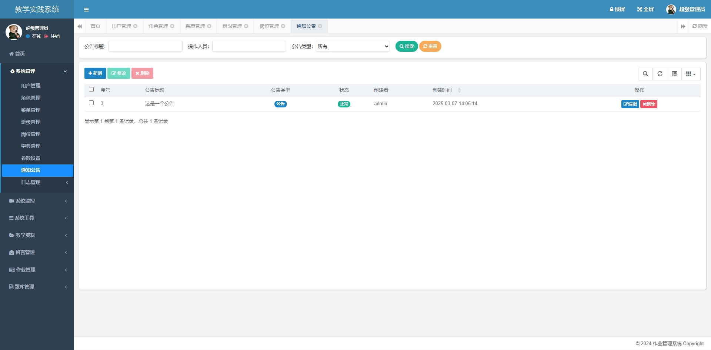

## 学生作业管理系统
基于ruoyi-fast版本不分离版本开发的学生作业管理系统

## 开发框架及所需环境
1. 开发框架:
    1.1 SpringBoot(基于若依框架-单体版)

2. 开发环境：
   2.1 安装JDK1.8+
   2.2 安装MySQL5.7+
   2.3 安装Maven
   2.4 安装IDEA

## 项目部署
1. 搭建JAVA开发环境->> 1.JDK1.8；2.安装MySQL5.7+；3.安装Maven；4.安装IntelliJ IDEA
2. 新建homework数据库，然后导入sql\homework.sql文件
3. 打开IntelliJ IDEA ，导入源代码
4. 修改数据库配置文件
    
5. 项目启动
### web
1. 运行bin/clean.bat
2. bin/package.bat 打包文件在target下
3. java -jar ruoyi.jar --springboot.datasourse.master.url= xxx --springboot.datasourse.master.password= xxx

或者 ./ry.sh start

## 一、系统主要功能
1. _**系统管理：**_ 超级管理有全部数据权限，教师只有2,3,4,5功能管理
2. _**教学资料：**_ 教师、管理员上传教学资料，学生只能下载
3. _**留言管理：**_ 学生只能留言和查看，教师、管理员对留言信息管理
4. _**作业管理：**_ 教师发布作业，批阅作业，学生提交与查看作业

## 二、系统角色
_**1. 超级管理员**_
_**2. 教师角色**_
_**3. 学生角色**_

## 三、功能测试账号密码
1. 超级管理员>账号：admin 密码:admin123
2. 普通管理员>账号: padmin 密码：123456
3. 学生>账号：学号 密码：123456

## 系统管理
**_1. 用户管理_**
**_2. 班级管理_**
**_3. 通知公告_**

## 教学资料
1. 只有老师和管理员有权限发布，其余学生只能下载

## 留言管理
1. 老师，管理员，学生都能留言
2. 学生只能留言和查看留言，不能修改和删除
3. 只有老师和管理员才能删除和修改留言

## 作业管理
### 教师端
1. 教师发布作业（哪个老师发布的作业就哪个老师看得见）
2. 教师批阅作业（只能批阅自己班级的作业）
3. 老师统计作业的提交情况
4. 老师导出作业数据
### 学生端
1. 我的作业（自己做的所有作业，查看和修改；已批阅不能修改）
2. 提交作业（只能做自己老师发布的作业，已过期不能写作业，已完成作业不能重复写作业）

## 四、系统截图
1. 写作业

2. 发布作业

3. 发布公告

4. 岗位管理

5. 提交作业

6. 教学资料

7. 添加试卷

8. 班级管理

9. 用户管理

10. 留言

11. 角色管理

12. 首页-公告

